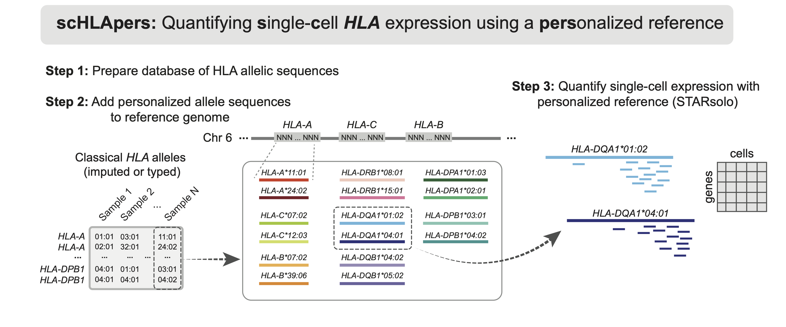

# scHLApers
Code to run the scHLApers pipeline for quantifying single-cell HLA expression using personalized reference genomes.

## Requirements & Dependencies
R program requires (listed version or higher):
* R=4.0.5
* Biostrings=2.58.0
* purrr=0.3.4
* readr=2.1.2
* stringi=1.7.8
* stringr=1.4.0
* tidyverse_1.3.1

Software:
* STAR=2.7.10a [https://github.com/alexdobin/STAR](https://github.com/alexdobin/STAR)
* samtools=1.4.1 [http://www.htslib.org/download/](http://www.htslib.org/download/)

Data:
* Reference genome (e.g. GRCh38.primary_assembly.genome.fa): available [here](https://ftp.ebi.ac.uk/pub/databases/gencode/Gencode_human/)
* Gene annotation file (e.g. gencode.v38.annotation.gtf): available [here](https://ftp.ebi.ac.uk/pub/databases/gencode/Gencode_human/)
* Cell barcode whitelist: more info [here](https://kb.10xgenomics.com/hc/en-us/articles/115004506263-What-is-a-barcode-whitelist-)

## Pipeline
Each step has its own directory with necessary scripts and a tutorial walking through the steps.

### Input
The inputs to scHLApers are:
* Raw scRNA-seq data (FASTQ or BAM format)
* HLA allele calls (in CSV format, labeled as "SampleX_alleles.csv", see `example_data/mock_cohort_alleles` for format)

See the [HLA analyses tutorial](https://github.com/immunogenomics/HLA_analyses_tutorial) from [Sakaue et al.](https://www.biorxiv.org/content/10.1101/2022.08.24.504550v1) for protocol for imputing HLA alleles from genotype array data.

### Step 1: Make HLA allele database
We provide a [pre-prepared database](1_make_HLA_database/IMGTHLA_all_alleles_FINAL.fa) generated from IPD-IMGT/HLA version 3.47 that can be directly used in Step 2. Alternatively, you can prepare your own database using the latest IPD-IMGT/HLA verison following the [tutorial](1_make_HLA_database/tutorial_make_database.ipynb).

### Step 2: Make personalized reference and annotation files
The [tutorial](2_make_personalized_refs/tutorial_make_pers_refs.ipynb) demonstrates how to generate personalized contigs (FASTA) and annotations (GTF) files that will be combined with the masked reference genome.
(TODO: Masking the reference)

### Step 3: Run the alignment with STARsolo
Example scripts for how to run STARsolo for read alignment and expression quantification in single-cell data.

### Outputs
The output of scHLApers is a genes by cells expression matrix, with improved classical HLA expression estimates.

## Support
For questions and assistance not answered in tutorials, you can contact Joyce Kang (joyce_kang AT hms.harvard DOT edu).

## Reproducing results from the manuscript
Code to reproduce the figures and analyses from Kang et al. will be available at [TODO].
